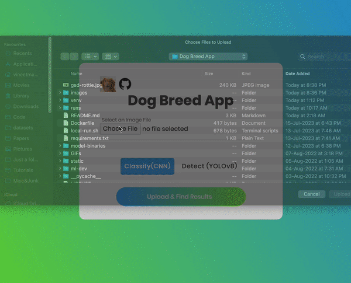

# Dog Breed App <small>(YOLOv8)</small>
[](https://www.kaggle.com/code/vineetmahajan/dog-breed-detection)
[](https://hub.docker.com/repository/docker/akavm/dog-breed-app/)


<!-- [](https://hub.docker.com/layers/akavm/dog-breed-app/0.1.1/images/sha256-592b5d37cf1256d64d613007676cc1553ce001573f4a7b737bdb7d190fa5edec?context=explore)
[](https://hub.docker.com/layers/akavm/dog-breed-app/0.1.1/images/sha256-c9e16a306518830e23b4565171b193abd62d4892f11a119478c6efa131f5ceb7?context=explore) -->


This Repository contains a Web App that can be used to detect the breed of all the dogs based on the image uploaded.

## What's New?
I have added new functionality to this app. Now it can detect the dog in the image and predict the breed of all the dogs in the image. I have used [YOLOv8](https://github.com/ultralytics/ultralytics).

You can look at the older version [here](https://github.com/aka-vm/Dog-Breed-App/tree/stable-v0_1). It is based on InceptionResNetV2. It is simpler you can refer it if you want to use your own model for a different CV task.


## Models
The Models are trained on [Stanford Dogs Dataset](http://vision.stanford.edu/aditya86/ImageNetDogs/). The dataset contains 20,580 images of 120 breeds of dogs.
### Classification
* The Classification model uses [InceptionResNetV2](https://keras.io/api/applications/inceptionresnetv2/) as the base model.
* It was selected after comparing the performance various other models, for more info visit the main Repo.
* [This Script](models/yolo-v8) gives a basic idea of how to use YOLOv8 for detection.
[This Repo](https://github.com/aka-vm/Hello-CV/tree/master/Stanford%20Dogs) contains the original code.

### Detection (YOLOv8)
* The Detection model uses YOLOv8. It is the latest version of YOLO.
* [This Script](models/InceptionResNetV2.py) trains the model on Stanford Dogs Dataset.
[This Repo](https://github.com/aka-vm/Hello-CV/tree/master/Stanford%20Dogs/detection) contains the original code, I've explained everything in detail there, go check it out.

## Web App
The server uses [FastAPI](https://fastapi.tiangolo.com/).<br>
I've hosted the app on Azure and DigitalOcean, and it works fine. But I recommend using [ngrok](https://ngrok.com/) for quick testing. The Docker image is also available on [Docker Hub](https://hub.docker.com/repository/docker/akavm/dog-breed-app).


## Running the app
Currently, this part is being updated. I'll add more details soon.
<!-- Two ways to run the app, If you want a quick test, I recommend using Docker. It'll work on arm64 and amd64. -->
### Using Regular Python

1. Clone the repo.
2. Create a virtual environment and install the requirements from `requirements.py`.
3. Download the models from [Google Drive](https://drive.google.com/drive/folders/1reZ8nb90H3a2K-mHCwpjiUWULtrlLfVn?usp=sharing) or `releases` and place it in the `model-binaries` folder.
4. Download The static files from [Google Drive](https://drive.google.com/drive/folders/1reZ8nb90H3a2K-mHCwpjiUWULtrlLfVn?usp=sharing) and place their content inside [static](./static/) folder.
5. Run the app using `python backend/main.py`. The app will be hosted on port [8000](localhost:8000).

```bash
# Outdated
# clone
git clone https://github.com/aka-vm/Dog-Breed-App
cd Dog-Breed-App

# Dependencies and environment
pip install virtualenv
virtualenv --python=python3.9.12 venv
source venv/bin/activate
pip install -r requirements.txt

# Download The model and paste it in the model-binaries folder
wget -O model-binaries/InceptionResNetV2.h5 https://github.com/aka-vm/Dog-Breed-App/releases/download/Classification-Model/InceptionResNetV2.h5
#! Download The Static Files from Here
#https://drive.google.com/file/d/1IP_i9OXzK5jSo9dm_1rvrHIIr6kozOiE/view?usp=share_link
# Run server
python backend/main.py
# for web testing I recommend using ngrok
```
### Using Docker
```bash
# Outdated
docker pull akavm/dog-breed-app:0.1.1
docker run -p 8000:8000 akavm/dog-breed-app:0.1.1
```

# Versions & Issues
I started this repo a year ago. Then It was left ideal for very long. Now I'm planning to make a full fledged app out of it.

## Future Vision
I do have a vision for this app to make it easily accessible to everyone but that is quite far away. That vision requires a lot of new data and more experiance as a ML Engineer. It'll be a great MLOps project.

## Current Version Targets
* [ ] Add Docker Support
* [ ] Optimize the requirements

## Future Version Targets
* [ ] Add a better UI using Single Page Application
* [ ] Better Frontend functions.
* [ ] Add authentication and user accounts to allow useage of better models.
* [ ] Add a better model for detection. (using YOLOv8 for similar looking objects is not a good idea) maybe something like a hybrid or multi-model.
* [ ] Offline support.


----------


<!-- Mobile View:
Height 200px


---------- -->

## Old Version:
✅ Stable
❌ Faster
✅ Cleaner
✅ Dockerized


## New Version:
❌ Stable
✅ Faster
❌ Cleaner
❌ Dockerized


